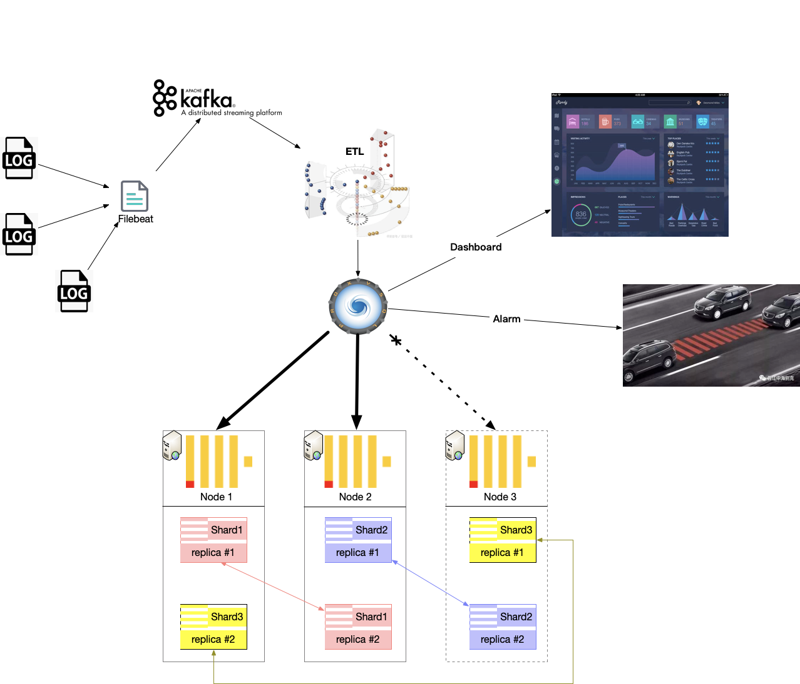

# 随行付统一监控平台

随行付从12年至今，6年时间里从零至2万亿交易额，经历了多次数据风暴，系统架构经历了数次更迭；随着微服务架构被广泛用于生产，迫切需要一种，可以发现、解决微服务架构下监控的解决方案，因此统一监控平台应运而生。

它的特点：

1. 大，日处理TB级数据量，年PB以上的数据
2. 快，real-time 显示视图图表，真的很real-time
3. 全，Events、Metrics、JVM Graph、CPU MEM Graph、TPS&RPS Graph、Business Graph
4. 向下兼容，兼容过去的架构采集的数据分析
5. 规则引擎、告警通知，支持微信、SMS、Email、OpenChat、村口大喇叭
6. 无嵌入，不影响业务、NIAO么悄的就把数据归集起来
7. 自动服务发现

## 从哪里来

### 2.0 基于Zabbix架构

### 3.0 基于ELK架构

#### ELK 是什么

ELK是**ElasticSearch**、**Logstash** 和 **Kibana**的简写，是Elastic公司开源的一套完整的日志收集、分析存储、展示等解决方案

* **ElasticSearch** 实时的分布式搜索和分析引擎，它使用Lucene实现全文索引，结构化搜索
* **Logstash** 实时传输能力的数据收集引擎\(有解析能力\)
* **Kibana** 可视化的 Web 平台，生成各种维度表格、图形

#### ELK 架构图

方案

Flume  Memory Channel OOM  

File Channel  正则解析  CPU Up

Flume Agent + 中间层集中解析  agent 重启丢数据

Logstash（亲儿子） + Kafka  日志解析占用过高资源

Filebeat  Hangout 

#### 问题

> **巨额投入，10 \* （32U 128G）+ PB 总价70W+ ，有钱也不能这么花，何况资本寒冬**

### 4.0 现在

#### 特点

1. 大，日处理TB级数据量，年PB以上的数据
2. 快，real-time 显示视图图表，真的很real-time
3. 全，Events、Metrics、JVM Graph、CPU MEM Graph、TPS&RPS Graph、Business Graph
4. 向下兼容，兼容过去的架构采集的数据分析
5. 规则引擎、告警通知，支持微信、SMS、Email、OpenChat、村口大喇叭
6. 无嵌入，不影响业务、NIAO么悄的就把数据归集起来
7. 自动服务发现
8. **发现性能瓶颈原因能力**
9. **发现内存溢出风险能力**

#### 现在的架构

#### Metrics Collection Domain

Metrics 采集域，通过注册中心自动发现微服务集群Application，然后采集各个App的metrics信息，我们采用一种取巧的形式，兼容prometheus exposer采集点，之所以这样考虑，因为它是_Google_ BorgMon监控系统的开源版本，在google 开源软件体系被良好的支持，如：K8S。

提供两种方式采集：

* Pull   Metrics 按频次发起请求，采集数据点
* Push Metrics 在App里主动向Push Gateway 发送测量数据

#### Behavior Collection Domain

行为采集域，采用低功耗的Filebeat采集日志，它在本地文件中记录了日志文件被读取到的位置，完美解决了升级重启时丢失数据的问题；Filebeat将采集到的数据发送到Kafka Cluster

#### Link Tracking Domain

敬请期待……

#### Time Series Storage

时序存储引擎，负责存储采集到的Metrics数据；每秒一个点，每次获取数百个微服务节点；

每天处理量：11396\(字节\) \* 86400/5\(5秒一个采集一个点\) = 939MB \* 100\(app\) = 91GB；

要求：

* 无缝接管Prometheus
* 大数据存储能力
* 大数据实时分析能力

#### Events Storage

#### 

#### Output Domain

输出域，目前支持JVM Graph、Thread Graph、CPU Graph、Events等

## 我干了啥

## 要去哪嘎达

我们下一步要做的事：

* 支持Docker、K8S、Rancher等容器内的事件采集
* 支持自定义仪表配置
* 支持更多中间件监控

## 总结

想知道我们的存储引擎是怎么做的吗，JOIN US。

