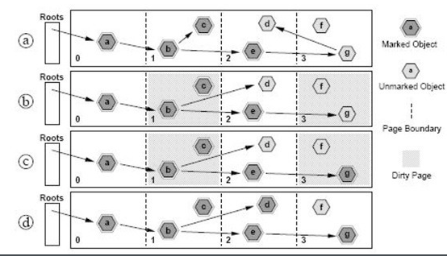

# JVM 1.7 Principle

## JDK 1.7 Architecture Diagram


```text
含义
-Xmx设置堆的最大空间大小。
-Xms设置堆的最小空间大小。
-XX:MaxNewSize设置新生代最大空间大小。
-XX:NewSize设置新生代最小空间大小。
-XX:MaxPermSize设置永久代最大空间大小。
-XX:PermSize设置永久代最小空间大小。
-Xss设置每个线程的堆栈大小。
```

## Roots Tracing \(可达性分析算法\)



## Reference Counting（引用计数法）

